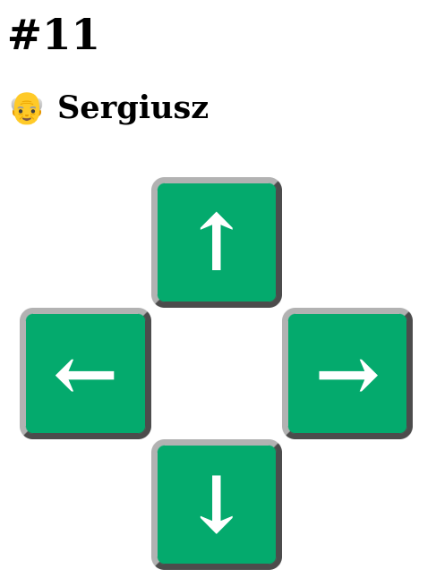

# Introduction
This repository contains my solution of making rolling shutters remote controllable via web browser. The work has been done before I have discovered [ESPSomfy-RTS](https://github.com/rstrouse/ESPSomfy-RTS).

In my case I soldered short wires to 4 microswitches on the remote and connected them to 4-channel relay module controlled by ESP32. Apart from clicking the buttons via relays, ESP32 was hosting simple page and kept last used channel in the memory (so 2 people could use it without messing up channel used by ESP32 and real channel set on the remote).

In the screen below you can see how the page looked like. Four arrows mimicked four main buttons from the remote.

After some time of using my solution, I have decided to switch to [ESPSomfy-RTS](https://github.com/rstrouse/ESPSomfy-RTS) which works faster and is more reliable. I had multiple situations where channel on the remote was off by 1 when comparing to internal channel on the server. Apart from that, I used 4 relays, where 1 of the relays was only used to click menu button on the remote to wake it up before changing to selected channel. That means that switching to a channel always meant incrementing current channel by 1, which caused some additional delays.

# Project structure
Project contains following files:
+ [init.sh](./init.sh) - init script that __must__ be run before building the project. Once run, it will create following files:
  + `WiFiConsts.h` - header file where you must put your wifi network credentials (for ESP32 to connect to)
  + `data/channel_names.js` - js file with a list of channels with names. Put your channel names into this file
+ [server.py](./server.py) - simple implementation of the server in python. Useful for testing the web page before uploading it to ESP32
+ [WiFiRemote.ino](./WiFiRemote.ino) - main Arduino project of the ESP32 server
+ [data/index.html](./data/index.html) - main page hosted by ESP32
+ [data/style.css](./data/style.css) - css file with styling of the `index.html`

It is important to note here that files from [data](./data) directory must be uploaded to the board after programming. I used [arduino-littlefs-upload](https://github.com/earlephilhower/arduino-littlefs-upload) for that purpose.